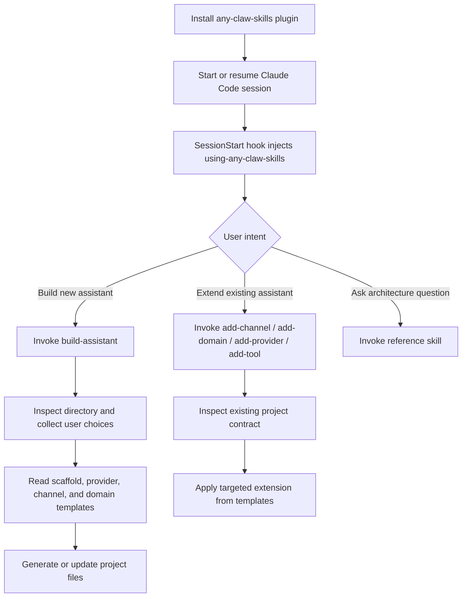

# any-claw-skills

English | [简体中文](README.zh-CN.md)

`any-claw-skills` is a Claude Code first skill package for reproducing **personal AI assistant products** from conversation. It is designed so Claude Code can vibe code anything from a PicoClaw-sized tiny assistant to a more capable CoPaw/OpenClaw-style system, then specialize it with out-of-the-box domain packs, tools, MCP surfaces, and prompts.

## What This Is

This repository ships:

- `skills/` for build and extension flows
- `commands/` for slash-command entrypoints
- `templates/` for scaffolds, providers, channels, and domains
- `docs/` for support policy, release checks, examples, and architecture analysis
- `tests/` for release verification scripts

It does not ship a standalone code generator CLI or service.

## Reference Product Modes

This repository is built around five reference product shapes:

- `PicoClaw` -> ultra-small assistant
- `NanoClaw` -> lightweight, highly customizable assistant
- `CoPaw` -> standard extensible assistant
- `OpenClaw` -> full multi-channel assistant product
- `IronClaw` -> security-hardened assistant platform

The builder should help Claude Code reproduce one of these shapes, then specialize it by domain, channels, providers, and capabilities.

## What Claude Code Does After Install

Once installed in Claude Code, the plugin changes the session workflow in a very specific way:

1. Claude Code loads the plugin metadata from [`.claude-plugin/plugin.json`](.claude-plugin/plugin.json).
2. On session start, resume, clear, or compact, [the session hook](hooks/hooks.json) runs [the startup script](hooks/session-start).
3. That startup script injects the full `using-any-claw-skills` meta-skill into the conversation context.
4. The meta-skill decides whether the user wants to:
   - build a new assistant
   - extend an existing assistant
   - inspect architecture references
5. Claude Code then invokes the right skill:
   - `build-assistant`
   - `add-channel`
   - `add-domain`
   - `add-provider`
   - `add-tool`
6. The invoked skill reads templates from this repository and guides Claude Code to reproduce or extend a real assistant project.

In short: this repo installs a workflow and a product-composition contract into Claude Code, not a standalone generator binary.

## Claude Code Workflow



## New Build vs Extend Existing

This distinction matters:

- If the current directory is empty or clearly a new project, Claude Code should route to `build-assistant`.
- If the current directory already looks like an assistant scaffold, Claude Code should prefer one of the extension skills instead of rebuilding the whole project.
- If the user only wants design guidance, Claude Code should use the reference skills without generating files.

That means the normal lifecycle in Claude Code is:

1. install the plugin
2. start a session in a working directory
3. let the meta-skill route the request
4. build once
5. extend incrementally as the assistant grows

This is how a user can start with something PicoClaw-small and iteratively grow it into a more capable, domain-specific personal assistant.

## Claude Code First

v0.1.0 is optimized for Claude Code. The primary supported story is:

1. Install the skill package in Claude Code
2. Start a new session in an empty project directory
3. Ask to build a personal assistant or run `/build-assistant`
4. Let the skill guide the AI through project choices
5. Generate a project from repository templates and extension skills

Metadata for Cursor, Codex, OpenCode, and Gemini is included, but release verification for v0.1.0 is centered on Claude Code.

## Golden Path

The v0.1.0 golden path is the recommended first build:

| Choice | Value |
|-------|-------|
| Tier | `Standard` |
| Stack | `Python` |
| Provider | `OpenAI` |
| Channels | `CLI + Telegram` |
| Domain | `Productivity` |
| Options | `.env.example + Docker + MCP server` |

This is the only path treated as fully release-verified for v0.1.0. Other combinations remain available, but many are Beta or Preview.

## Installation

### Claude Code

The repository includes Claude plugin metadata in [`.claude-plugin/plugin.json`](.claude-plugin/plugin.json) and [`.claude-plugin/marketplace.json`](.claude-plugin/marketplace.json).

Example development marketplace flow:

```bash
/plugin marketplace add any-claw/any-claw-skills-marketplace
/plugin install any-claw-skills@any-claw-skills-marketplace
```

If you maintain a local or internal marketplace, point Claude Code at this repository and use the same plugin metadata.

Marketplace registration and real install verification remain part of the manual release checklist.

### Secondary Clients

- Codex: [`.codex/INSTALL.md`](.codex/INSTALL.md)
- OpenCode: [`.opencode/INSTALL.md`](.opencode/INSTALL.md)
- Cursor: [`.cursor-plugin/plugin.json`](.cursor-plugin/plugin.json)
- Gemini: [`GEMINI.md`](GEMINI.md)

These are included for compatibility, not because they are release-equal to Claude Code in v0.1.0.

## Quick Start

Start a new Claude Code session and say:

> I want to build a personal assistant

Or run:

> `/build-assistant`

The skill should steer the session toward the recommended path unless you explicitly choose Beta or Preview combinations.

## Support Matrix

Release support is split into three levels:

- `GA`: recommended and release-verified
- `Beta`: included and documented, but verified less deeply
- `Preview`: reference material or starter templates without strong release guarantees

Current highlights:

| Surface | Status |
|-------|--------|
| Claude Code entrypoints | GA |
| `build-assistant` and extension skills | GA |
| `Standard / Python / OpenAI / CLI / Telegram / Productivity` | GA |
| Anthropic, Ollama, Discord, Slack, Health, Finance | Beta |
| Other tiers, stacks, and most remaining templates | Preview |

Full details: [`docs/support-matrix.md`](docs/support-matrix.md)

## Repository Guide

### Core Skills

| Skill | Purpose |
|-------|---------|
| `using-any-claw-skills` | Session-start routing and support-tier framing |
| `build-assistant` | Interactive assistant builder flow |
| `add-channel` | Expand an existing generated assistant with a new channel |
| `add-domain` | Add a vertical domain pack |
| `add-provider` | Add an LLM provider integration |
| `add-tool` | Create a custom tool that matches project conventions |

### Reference Skills

| Skill | Purpose |
|-------|---------|
| `architecture-patterns` | Agent runtime structure across reference projects |
| `channel-patterns` | Channel adapter design references |
| `provider-patterns` | Provider abstraction references |
| `tool-patterns` | Tool and skill system references |
| `storage-patterns` | Persistence and state references |
| `observability-patterns` | Logging, tracing, and replay references |

## Release Docs

- Support policy: [`docs/support-matrix.md`](docs/support-matrix.md)
- Product composition model: [`docs/assistant-product-composition-model.md`](docs/assistant-product-composition-model.md)
- Release checklist: [`docs/release-checklist.md`](docs/release-checklist.md)
- Testing guide: [`docs/testing.md`](docs/testing.md)
- Domain pack contract: [`docs/domain-pack-contract.md`](docs/domain-pack-contract.md)
- Golden path example: [`docs/examples/golden-path-standard-python-productivity.md`](docs/examples/golden-path-standard-python-productivity.md)
- Current status: [`STATUS.md`](STATUS.md)

## Roadmap

### v0.1.0

- Ship a credible Claude Code first release
- Make the golden path explicit and testable
- Distinguish GA, Beta, and Preview surfaces
- Add repeatable release verification and CI

### After v0.1.0

- Deepen Beta domain packs
- Improve non-Claude client verification
- Add more evidence for advanced stacks and channels
- Validate official marketplace submission if desired

## Contributing

Start with [`CONTRIBUTING.md`](CONTRIBUTING.md). Keep changes aligned with the published support matrix instead of broadening scope without verification.

## License

MIT License. See [`LICENSE`](LICENSE).
