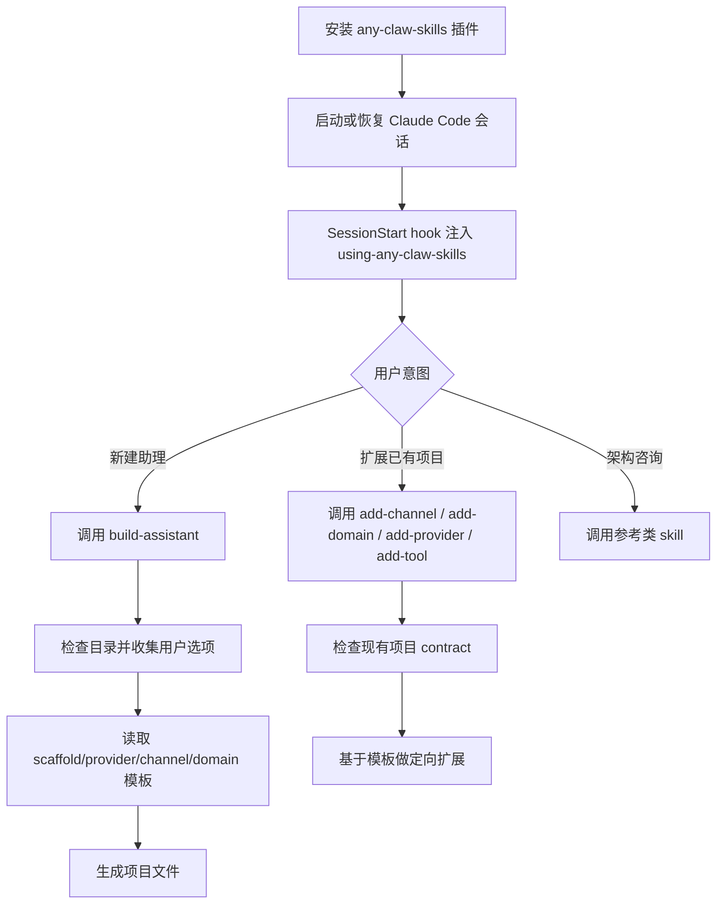

# any-claw-skills

[English](README.md) | 简体中文

`any-claw-skills` 是一个面向 Claude Code 优先的 skills 包，用来通过对话复现**个人 AI 助理产品**。它的目标是让 Claude Code 可以从像 PicoClaw 那样的超小助理，一路 vibe code 到更接近 CoPaw / OpenClaw 这种更完整的个人助理系统，并且根据用户选择的垂直领域，自动带上开箱即用的工具、MCP、系统提示词和领域知识。

## 这是什么

这个仓库提供的是：

- `skills/`：构建与扩展流程
- `commands/`：斜杠命令入口
- `templates/`：脚手架、provider、channel、domain 模板
- `docs/`：支持矩阵、发布检查、示例、架构分析
- `tests/`：发布验证脚本

它不是一个独立的代码生成 CLI 或后端服务。

## 参考产品模式

这个仓库围绕五种参考产品形态来组织：

- `PicoClaw` -> 超小型助理
- `NanoClaw` -> 轻量、可高度定制的助理
- `CoPaw` -> 标准化、可扩展的助理
- `OpenClaw` -> 多渠道、产品化的个人助理
- `IronClaw` -> 更强调安全和扩展边界的助理平台

`build-assistant` 的真正目标，不是“问几个选项然后生成文件”，而是帮助 Claude Code 复现其中一种产品形态，再按用户选的领域、渠道、模型和能力模块去做装配。

## 安装后 Claude Code 会怎么工作

安装到 Claude Code 之后，工作流会变成下面这样：

1. Claude Code 先读取 [`.claude-plugin/plugin.json`](.claude-plugin/plugin.json) 里的插件元数据。
2. 在 session `start / resume / clear / compact` 时，[hooks 配置](hooks/hooks.json) 会触发 [session-start 脚本](hooks/session-start)。
3. 这个脚本会把 `using-any-claw-skills` 这个入口 meta-skill 的完整内容注入当前会话上下文。
4. 然后 Claude Code 会根据用户意图做路由：
   - 新建一个助理项目
   - 扩展已有助理项目
   - 只查看架构与设计参考
5. 接着再调用对应 skill：
   - `build-assistant`
   - `add-channel`
   - `add-domain`
   - `add-provider`
   - `add-tool`
6. 被调用的 skill 会继续去读取本仓库里的模板文件，并指导 Claude Code 生成或扩展真实项目。

所以它的本质不是“装了一个生成器程序”，而是“给 Claude Code 装进去一整套个人助理产品的构建工作流和产品装配 contract”。

## Claude Code 工作流



## 新建项目和增量扩展的区别

这个边界很重要：

- 如果当前目录是空的，或者明显是一个新项目，Claude Code 应该进入 `build-assistant`
- 如果当前目录已经像一个生成过的 assistant scaffold，就不应该重新全量生成，而应该优先走扩展 skill
- 如果用户只是问架构问题，就应该走 reference skills，而不是生成文件

所以在 Claude Code 里的典型生命周期会是：

1. 安装插件
2. 在某个工作目录里开启会话
3. 让入口 meta-skill 先判断意图
4. 第一次用 `build-assistant` 建骨架
5. 后续不断用 `add-*` skill 做增量扩展

这也是为什么它应该支持“先做一个 PicoClaw 级别的小助理，再逐步长成更完整的、可维护的垂直领域个人助理产品”。

## Claude Code First

v0.1.0 版本是围绕 Claude Code 优先打磨的。主支持路径是：

1. 在 Claude Code 中安装这个 skills 包
2. 在一个空目录里开启新会话
3. 直接说 “I want to build a personal assistant” 或运行 `/build-assistant`
4. 让 skill 一步一步引导选型
5. 再从本仓库模板中复现一个助理项目

Cursor、Codex、OpenCode、Gemini 的元数据和适配说明也有，但 v0.1.0 的验证中心仍然是 Claude Code。

## 推荐主路径

v0.1.0 当前推荐的 golden path 是：

| 选项 | 推荐值 |
|------|--------|
| Tier | `Standard` |
| Stack | `Python` |
| Provider | `OpenAI` |
| Channels | `CLI + Telegram` |
| Domain | `Productivity` |
| Options | `.env.example + Docker + MCP server` |

这条路径是 v0.1.0 唯一按 release-ready 标准重点验证的主路径。其他组合仍可用，但很多还属于 Beta 或 Preview。

## 安装

### Claude Code

仓库中已经包含 Claude Code 插件元数据：[`.claude-plugin/plugin.json`](.claude-plugin/plugin.json) 和 [`.claude-plugin/marketplace.json`](.claude-plugin/marketplace.json)。

一个开发 marketplace 的示例安装方式：

```bash
/plugin marketplace add any-claw/any-claw-skills-marketplace
/plugin install any-claw-skills@any-claw-skills-marketplace
```

如果你维护的是本地或私有 marketplace，也可以直接基于仓库里的插件元数据接入。

不过 marketplace 注册和真实安装验证，目前仍属于手动 release checklist 的一部分。

### 其他客户端

- Codex: [`.codex/INSTALL.md`](.codex/INSTALL.md)
- OpenCode: [`.opencode/INSTALL.md`](.opencode/INSTALL.md)
- Cursor: [`.cursor-plugin/plugin.json`](.cursor-plugin/plugin.json)
- Gemini: [`GEMINI.md`](GEMINI.md)

这些是兼容性支持，不代表它们在 v0.1.0 已经和 Claude Code 同级成熟。

## 快速开始

在 Claude Code 中开启一个新会话后，直接说：

> I want to build a personal assistant

或者运行：

> `/build-assistant`

如果你没有明确指定更复杂或更实验性的组合，skill 应该会优先把你引导到推荐主路径。

而且真正有意义的第一问，应该是“你要复现哪种产品形态 / reference mode”，而不是一上来先问技术栈细节。

## 支持矩阵

当前发布支持分三层：

- `GA`：推荐、且进入了发布验证
- `Beta`：已包含、已文档化，但验证深度比 GA 低
- `Preview`：主要作为参考或起步模板，不做强保证

当前重点：

| 范围 | 状态 |
|------|------|
| Claude Code 入口能力 | GA |
| `build-assistant` 与扩展 skills | GA |
| `Standard / Python / OpenAI / CLI / Telegram / Productivity` | GA |
| Anthropic、Ollama、Discord、Slack、Health、Finance | Beta |
| 其他 tier、stack 与大部分模板 | Preview |

完整内容见 [`docs/support-matrix.md`](docs/support-matrix.md)。

## 仓库结构

### 核心 Skills

| Skill | 作用 |
|-------|------|
| `using-any-claw-skills` | Session 启动后的入口路由与支持层级说明 |
| `build-assistant` | 新助理项目的交互式构建流程 |
| `add-channel` | 给已有项目增加消息渠道 |
| `add-domain` | 给已有项目增加垂直领域包 |
| `add-provider` | 给已有项目增加模型提供商 |
| `add-tool` | 给已有项目增加自定义工具 |

### 参考 Skills

| Skill | 作用 |
|-------|------|
| `architecture-patterns` | 参考不同 assistant 项目的 runtime 结构 |
| `channel-patterns` | 参考 channel adapter 设计 |
| `provider-patterns` | 参考 provider abstraction 设计 |
| `tool-patterns` | 参考 tool / skill system 设计 |
| `storage-patterns` | 参考状态与持久化设计 |
| `observability-patterns` | 参考日志、追踪、回放设计 |

## 发布相关文档

- 支持策略：[`docs/support-matrix.md`](docs/support-matrix.md)
- 产品装配模型：[`docs/assistant-product-composition-model.md`](docs/assistant-product-composition-model.md)
- 发布检查：[`docs/release-checklist.md`](docs/release-checklist.md)
- 测试说明：[`docs/testing.md`](docs/testing.md)
- Domain pack contract：[`docs/domain-pack-contract.md`](docs/domain-pack-contract.md)
- Golden path 示例：[`docs/examples/golden-path-standard-python-productivity.md`](docs/examples/golden-path-standard-python-productivity.md)
- 当前状态：[`STATUS.md`](STATUS.md)

## Roadmap

### v0.1.0

- 做成一个可信的 Claude Code first 发布包
- 把 golden path 讲清楚并验证清楚
- 明确区分 GA、Beta、Preview
- 建立可重复执行的 release verification 和 CI

### v0.1.0 之后

- 深化 Beta 领域包
- 补强非 Claude 客户端的验证
- 给更复杂的 stack 和 channel 增加更多证据
- 如果需要，再做官方 marketplace 提交验证

## 贡献

先看 [`CONTRIBUTING.md`](CONTRIBUTING.md)。不要只是一味加模板数量，而要保证支持矩阵、文档、测试和实际能力一致。

## License

MIT License，见 [`LICENSE`](LICENSE)。
