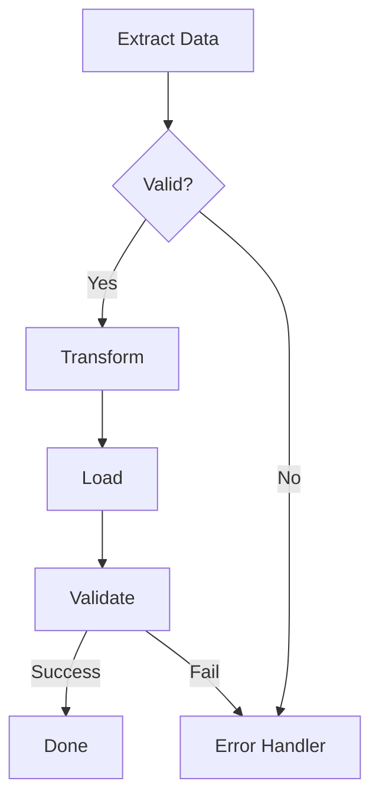

# AI Agent 完整技术架构深度调研报告

## 整合版：RAG Orchestration + Agent Loop + Context Pipeline + Tool System + Skills

---

## 目录

1. [RAG Orchestration 完整流程](#一rag-orchestration-完整流程)
2. [Agent Loop 架构对比](#二agent-loop-架构对比)
3. [上下文装配 Pipeline](#三上下文装配-pipeline)
4. [Tool Registry + Post-processing](#四tool-registry--post-processing)
5. [Skills 体系设计](#五skills-体系设计)
6. [推荐架构](#六推荐架构)

---

## 一、RAG Orchestration 完整流程

### 1.1 完整 RAG Pipeline 架构

```
┌─────────────────────────────────────────────────────────────────────────────┐
│                        RAG Orchestration Pipeline                           │
├─────────────────────────────────────────────────────────────────────────────┤
│                                                                             │
│  ┌─────────────────┐                                                        │
│  │  User Query     │                                                        │
│  │  用户查询       │                                                        │
│  └────────┬────────┘                                                        │
│           │                                                                 │
│           ▼                                                                 │
│  ┌─────────────────────────────────────────────────────────────────────┐   │
│  │  Stage 1: Query Rewrite / Transformation                            │   │
│  │  查询重写与变换                                                      │   │
│  │                                                                     │   │
│  │  ┌──────────────┐  ┌──────────────┐  ┌──────────────┐              │   │
│  │  │ Query        │  │ HyDE         │  │ Multi-Query  │              │   │
│  │  │ Expansion    │  │ (Hypothetical│  │ Generation   │              │   │
│  │  │ 查询扩展      │  │  Document    │  │ 多查询生成    │              │   │
│  │  │              │  │  Embedding)  │  │              │              │   │
│  │  │ • Synonyms   │  │              │  │ • 3-5 variants│             │   │
│  │  │ • Stopwords  │  │ • Generate   │  │ • Sub-queries│              │   │
│  │  │ • Keywords   │  │   fake docs  │  │ • Decomposition│            │   │
│  │  └──────────────┘  └──────────────┘  └──────────────┘              │   │
│  └─────────────────────────────────────────────────────────────────────┘   │
│           │                                                                 │
│           ▼                                                                 │
│  ┌─────────────────────────────────────────────────────────────────────┐   │
│  │  Stage 2: Multi-Vector Retrieve                                     │   │
│  │  多向量检索                                                          │   │
│  │                                                                     │   │
│  │   Dense Vector (0.7)        Sparse/BM25 (0.3)                      │   │
│  │   ┌──────────────┐          ┌──────────────┐                       │   │
│  │   │ Embedding    │          │ Tokenization │                       │   │
│  │   │ Model        │          │ + Inverted   │                       │   │
│  │   │ (1024-dim)   │          │ Index        │                       │   │
│  │   └──────┬───────┘          └──────┬───────┘                       │   │
│  │          │                         │                                │   │
│  │          ▼                         ▼                                │   │
│  │   ┌──────────────┐          ┌──────────────┐                       │   │
│  │   │ Vector DB    │          │ BM25 Score   │                       │   │
│  │   │ (Chroma/     │          │ Calculation  │                       │   │
│  │   │  Postgres)   │          │              │                       │   │
│  │   └──────┬───────┘          └──────┬───────┘                       │   │
│  │          │                         │                                │   │
│  │          └───────────┬─────────────┘                                │   │
│  │                      │                                              │   │
│  │                      ▼                                              │   │
│  │           ┌────────────────────┐                                   │   │
│  │           │ Candidate Pool     │                                   │   │
│  │           │ (3x top-k, max 200)│                                   │   │
│  │           │ Deduplication      │                                   │   │
│  │           └─────────┬──────────┘                                   │   │
│  └─────────────────────────────────────────────────────────────────────┘   │
│           │                                                                 │
│           ▼                                                                 │
│  ┌─────────────────────────────────────────────────────────────────────┐   │
│  │  Stage 3: Reranking                                                 │   │
│  │  重排序                                                              │   │
│  │                                                                     │   │
│  │  ┌──────────────┐  ┌──────────────┐  ┌──────────────┐              │   │
│  │  │ MMR          │  │ Cross-Encoder│  │ Recency      │              │   │
│  │  │ (Diversity)  │  │ Reranker     │  │ Boost        │              │   │
│  │  │              │  │              │  │              │              │   │
│  │  │ λ = 0.7      │  │ BERT-based   │  │ half-life    │              │   │
│  │  │ relevance    │  │ pair-wise    │  │ = 30 days    │              │   │
│  │  │ + diversity  │  │ scoring      │  │              │              │   │
│  │  └──────────────┘  └──────────────┘  └──────────────┘              │   │
│  │                                                                     │   │
│  │  Score = α·dense_score + β·bm25_score + γ·mmr_score + δ·recency    │   │
│  └─────────────────────────────────────────────────────────────────────┘   │
│           │                                                                 │
│           ▼                                                                 │
│  ┌─────────────────────────────────────────────────────────────────────┐   │
│  │  Stage 4: Context Assembly                                          │   │
│  │  上下文组装                                                          │   │
│  │                                                                     │   │
│  │  Chunk Ordering:        Token Budget:                               │   │
│  │  ┌──────────────┐       ┌──────────────┐                           │   │
│  │  │ Relevance    │       │ Total: 128k  │                           │   │
│  │  │ (desc)       │       │ Reserve: 20k │                           │   │
│  │  │              │       │ Available    │                           │   │
│  │  │ + Citation   │       │ = 108k       │                           │   │
│  │  │   markers    │       └──────────────┘                           │   │
│  │  └──────────────┘                                                  │   │
│  │                                                                     │   │
│  │  Format:                                                            │   │
│  │  ```                                                                │   │
│  │  <source id="1" path="file.py" lines="10-20" score="0.95">          │   │
│  │  chunk content here...                                              │   │
│  │  </source>                                                          │   │
│  │  ```                                                                │   │
│  └─────────────────────────────────────────────────────────────────────┘   │
│           │                                                                 │
│           ▼                                                                 │
│  ┌─────────────────────────────────────────────────────────────────────┐   │
│  │  Stage 5: Generation with Citations                                 │   │
│  │  带引用的生成                                                        │   │
│  │                                                                     │   │
│  │  System Prompt:                                                     │   │
│  │  "Use [^index^] format to cite sources.                             │   │
│  │   Every factual claim must have a citation."                        │   │
│  │                                                                     │   │
│  │  Citation Modes:                                                    │   │
│  │  • auto: Automatic based on relevance                               │   │
│  │  • on:  Always cite                                                 │   │
│  │  • off: Never cite                                                  │   │
│  └─────────────────────────────────────────────────────────────────────┘   │
│                                                                             │
└─────────────────────────────────────────────────────────────────────────────┘
```

### 1.2 Query Rewrite 详解

#### 1.2.1 Query Expansion（查询扩展）

**openclaw 实现**:

```typescript
// src/agents/memory-search.ts
function expandQuery(query: string, locale: string): string[] {
  const stopwords = getStopwordsForLocale(locale);
  const tokens = tokenize(query)
    .filter(t => !stopwords.includes(t.toLowerCase()));

  // Synonym expansion
  const synonyms = tokens.flatMap(t => getSynonyms(t));

  // Keyword extraction
  const keywords = extractKeywords(query, { topK: 5 });

  return [
    query,
    tokens.join(" "),
    [...tokens, ...synonyms].join(" "),
    keywords.join(" "),
  ];
}
```

**支持的语言**:
- English, Chinese, Japanese, Korean
- German, French, Spanish

#### 1.2.2 HyDE (Hypothetical Document Embedding)

```python
# 伪代码实现
async def hyde_retrieval(query: str) -> List[Document]:
    # Step 1: Generate hypothetical answer
    hypothetical_doc = await llm.generate(
        prompt=f"Given the query '{query}', write a hypothetical document that would answer it."
    )

    # Step 2: Embed both query and hypothetical doc
    query_embedding = embed(query)
    hyde_embedding = embed(hypothetical_doc)

    # Step 3: Retrieve using weighted combination
    results = vector_db.search(
        query_vector=0.3 * query_embedding + 0.7 * hyde_embedding,
        top_k=10
    )

    return results
```

#### 1.2.3 Multi-Query Generation

```python
# CoPaw 风格的实现
async def generate_multi_queries(original_query: str) -> List[str]:
    prompt = f"""
Generate 3 different versions of the following query to improve retrieval:
Query: {original_query}

Rules:
1. Reword using different terminology
2. Break into sub-questions if complex
3. Include specific technical terms

Output format:
- Query 1: <variant>
- Query 2: <variant>
- Query 3: <variant>
"""

    response = await llm.generate(prompt)
    queries = parse_queries(response)
    return [original_query] + queries
```

### 1.3 Retrieve 策略详解

#### 1.3.1 Hybrid Retrieval（混合检索）

**CoPaw 实现**:

```python
# src/copaw/agents/memory/memory_manager.py
async def hybrid_search(
    self,
    query: str,
    top_k: int = 5,
) -> List[SearchResult]:
    # Dense retrieval (Vector)
    vector_results = await self.vector_search(query, top_k=top_k*3)

    # Sparse retrieval (BM25)
    bm25_results = self.bm25_search(query, top_n=top_k*3)

    # Fusion
    merged = self.reciprocal_rank_fusion(
        [vector_results, bm25_results],
        weights=[0.7, 0.3]
    )

    return merged[:top_k]

def reciprocal_rank_fusion(
    self,
    results_list: List[List[SearchResult]],
    weights: List[float],
    k: int = 60
) -> List[SearchResult]:
    """RRF: Reciprocal Rank Fusion"""
    scores = defaultdict(float)

    for results, weight in zip(results_list, weights):
        for rank, result in enumerate(results):
            scores[result.id] += weight * (1.0 / (k + rank + 1))

    # Sort by fused score
    return sorted(scores.items(), key=lambda x: x[1], reverse=True)
```

#### 1.3.2 BM25 实现

```python
class BM25Searcher:
    def __init__(self, documents: List[str], k1: float = 1.5, b: float = 0.75):
        self.documents = documents
        self.k1 = k1
        self.b = b
        self.avgdl = sum(len(d.split()) for d in documents) / len(documents)

        # Build inverted index
        self.inverted_index = self._build_index()

    def _build_index(self) -> Dict[str, List[int]]:
        index = defaultdict(list)
        for doc_id, doc in enumerate(self.documents):
            for term in set(doc.split()):
                index[term].append(doc_id)
        return index

    def search(self, query: str, top_n: int = 10) -> List[Tuple[int, float]]:
        query_terms = query.split()
        scores = defaultdict(float)

        for term in query_terms:
            if term in self.inverted_index:
                idf = self._calculate_idf(term)
                for doc_id in self.inverted_index[term]:
                    tf = self.documents[doc_id].split().count(term)
                    doc_len = len(self.documents[doc_id].split())

                    # BM25 formula
                    score = idf * (tf * (self.k1 + 1)) / (
                        tf + self.k1 * (1 - self.b + self.b * doc_len / self.avgdl)
                    )
                    scores[doc_id] += score

        return sorted(scores.items(), key=lambda x: x[1], reverse=True)[:top_n]
```

### 1.4 Reranking 详解

#### 1.4.1 MMR (Maximal Marginal Relevance)

```python
def mmr_rerank(
    query_embedding: np.ndarray,
    doc_embeddings: np.ndarray,
    doc_ids: List[str],
    lambda_param: float = 0.7,
    top_k: int = 10
) -> List[Tuple[str, float]]:
    """
    MMR = λ * Sim(query, doc) - (1-λ) * max Sim(doc, selected_docs)
    """
    selected = []
    remaining = list(range(len(doc_ids)))

    while len(selected) < top_k and remaining:
        best_score = -float('inf')
        best_idx = None

        for idx in remaining:
            # Relevance to query
            relevance = cosine_similarity(query_embedding, doc_embeddings[idx])

            # Diversity penalty
            if selected:
                max_sim = max(
                    cosine_similarity(doc_embeddings[idx], doc_embeddings[s])
                    for s in selected
                )
            else:
                max_sim = 0

            # MMR score
            score = lambda_param * relevance - (1 - lambda_param) * max_sim

            if score > best_score:
                best_score = score
                best_idx = idx

        selected.append(best_idx)
        remaining.remove(best_idx)

    return [(doc_ids[i], cosine_similarity(query_embedding, doc_embeddings[i]))
            for i in selected]
```

#### 1.4.2 Cross-Encoder Reranker

```python
class CrossEncoderReranker:
    def __init__(self, model_name: str = "cross-encoder/ms-marco-MiniLM-L-6-v2"):
        self.model = CrossEncoder(model_name)

    def rerank(
        self,
        query: str,
        documents: List[str],
        top_k: int = 10
    ) -> List[Tuple[str, float]]:
        # Create query-doc pairs
        pairs = [(query, doc) for doc in documents]

        # Get scores
        scores = self.model.predict(pairs)

        # Sort and return
        results = list(zip(documents, scores))
        results.sort(key=lambda x: x[1], reverse=True)

        return results[:top_k]
```

#### 1.4.3 时间衰减评分

```typescript
// openclaw 实现
function applyTemporalDecay(
    score: number,
    timestamp: number,
    halfLifeDays: number = 30
): number {
    const ageInDays = (Date.now() - timestamp) / (1000 * 60 * 60 * 24);
    const decayFactor = Math.pow(0.5, ageInDays / halfLifeDays);
    return score * decayFactor;
}
```

### 1.5 Context Assembly 详解

#### 1.5.1 Chunk 配置

```typescript
// openclaw 默认配置
interface ChunkConfig {
    chunkTokens: 400;           // 每块 token 数
    chunkOverlapTokens: 80;     // 重叠 token 数 (20%)
    vectorWeight: 0.7;          // 向量权重
    textWeight: 0.3;            // 文本权重
    candidateMultiplier: 4;     // 候选倍数
    topK: {
        memory: 5;              // 记忆检索 top-k
        sessions: 5;            // 会话检索 top-k
    };
}
```

#### 1.5.2 Citation 格式

**openclaw 格式**:
```xml
<source
    id="1"
    path="src/utils/helpers.py"
    lines="45-60"
    score="0.95"
    timestamp="2024-01-15T10:30:00Z"
>
function helper() {
    // implementation
}
</source>
```

**引用模式**:
```typescript
type CitationMode = "auto" | "on" | "off";

// auto: 基于相关性自动决定
// on: 总是引用
// off: 从不引用
```

### 1.6 各项目 RAG 能力对比

| 功能 | CoPaw | openclaw | kimi-cli | opencode |
|------|-------|----------|----------|----------|
| **Query Rewrite** | ❌ | ✅ 多语言扩展 | ❌ | ❌ |
| **Dense Retrieval** | ✅ Chroma | ✅ 可配置 | ❌ | ❌ |
| **Sparse/BM25** | ✅ | ✅ | ❌ | ❌ |
| **Hybrid** | ✅ 0.7/0.3 | ✅ 可配置权重 | ❌ | ❌ |
| **MMR Rerank** | ❌ | ✅ λ=0.7 | ❌ | ❌ |
| **Cross-Encoder** | ❌ | ❌ | ❌ | ❌ |
| **Temporal Decay** | ❌ | ✅ 30天半衰期 | ❌ | ❌ |
| **Citation** | ✅ | ✅ auto/on/off | ❌ | ❌ |

---

## 二、Agent Loop 架构对比

### 2.1 四种架构概览

```
┌─────────────────────────────────────────────────────────────────────────────┐
│                        Agent Loop Architecture Comparison                   │
├─────────────────────────────────────────────────────────────────────────────┤
│                                                                             │
│  ┌─────────────────────────────────────────────────────────────────────┐   │
│  │  CoPaw: ReAct Loop (AgentScope)                                     │   │
│  │                                                                     │   │
│  │   User ──> Reasoning ──> Acting ──> Observation ──> Memory         │   │
│  │              │             │              │              │          │   │
│  │              ▼             ▼              ▼              ▼          │   │
│  │           [LLM]      [Tool Call]    [Tool Result]   [Store]         │   │
│  │              │             │              │              │          │   │
│  │              └─────────────┴──────────────┘              │          │   │
│  │                          │ max_iters=50                 │          │   │
│  │                          ▼                             │          │   │
│  │                    Continue? ──Yes──> Loop              │          │   │
│  │                          │                             │          │   │
│  │                          No                            │          │   │
│  │                          ▼                             │          │   │
│  │                       Reply to User <───────────────────┘          │   │
│  └─────────────────────────────────────────────────────────────────────┘   │
│                                                                             │
│  ┌─────────────────────────────────────────────────────────────────────┐   │
│  │  kimi-cli: Step Loop                                                │   │
│  │                                                                     │   │
│  │   User ──> Turn Begin ──> Step 1 ──> Step 2 ──> ... ──> Turn End   │   │
│  │              │            │            │                │          │   │
│  │              ▼            ▼            ▼                ▼          │   │
│  │           [Steer      [LLM +      [LLM +           [Final         │   │
│  │            Queue]      Tools]      Tools]            Reply]        │   │
│  │                          │            │                            │   │
│  │                          ▼            ▼                            │   │
│  │                    Tool Results ──> Context Grow                   │   │
│  │                                                                     │   │
│  │   Special: D-Mail (checkpoint revert)                              │   │
│  │           Flow Skills (Mermaid/D2)                                 │   │
│  └─────────────────────────────────────────────────────────────────────┘   │
│                                                                             │
│  ┌─────────────────────────────────────────────────────────────────────┐   │
│  │  openclaw: Pi Event Stream                                          │   │
│  │                                                                     │   │
│  │   Event Stream:                                                     │   │
│  │   session.start ──> tool.discovery ──> prompt.assembly             │   │
│  │       │                                    │                        │   │
│  │       ▼                                    ▼                        │   │
│  │   message.recv ──> llm.stream ──> tool.call ──> result.recv        │   │
│  │       │                │             │            │                 │   │
│  │       │                │             ▼            │                 │   │
│  │       │                │        [Sandbox]        │                 │   │
│  │       │                │             │            │                 │   │
│  │       └────────────────┴─────────────┴────────────┘                 │   │
│  │                        │                                            │   │
│  │                        ▼                                            │   │
│  │                   response.send                                     │   │
│  │                                                                     │   │
│  │   Features: Sub-agent spawn, Heartbeat, Silent replies             │   │
│  └─────────────────────────────────────────────────────────────────────┘   │
│                                                                             │
│  ┌─────────────────────────────────────────────────────────────────────┐   │
│  │  opencode: Vercel AI SDK Stream                                     │   │
│  │                                                                     │   │
│  │   Stream Events:                                                    │   │
│  │   start ──> reasoning ──> tool-call ──> tool-result ──> finish     │   │
│  │     │          │            │             │              │         │   │
│  │     ▼          ▼            ▼             ▼              ▼         │   │
│  │   [Init]   [Thinking]   [Execute]    [Process]      [Complete]     │   │
│  │                           │                                            │   │
│  │                           ▼                                            │   │
│  │                      Permission Check                                │   │
│  │                                                                     │   │
│  │   Features: Parts system, Compaction agent, Multi-agent            │   │
│  └─────────────────────────────────────────────────────────────────────┘   │
│                                                                             │
└─────────────────────────────────────────────────────────────────────────────┘
```

### 2.2 详细对比表

| 维度 | CoPaw (ReAct) | kimi-cli (Step) | openclaw (Pi) | opencode (Vercel) |
|------|---------------|-----------------|---------------|-------------------|
| **核心类** | `ReActAgent` | `KimiSoul` | Pi Agent | `SessionProcessor` |
| **循环粒度** | Reasoning-Acting | Turn-Step | Event-driven | Stream-based |
| **最大迭代** | `max_iters=50` | `max_steps_per_turn` | 动态 | 动态 |
| **并发模型** | asyncio | asyncio | Node.js Event Loop | Node.js Streams |
| **工具调用** | Sequential | Parallel | Parallel | Parallel |
| **特殊功能** | ToolGuard | D-Mail, Flow | Sandbox, Heartbeat | Parts, Compaction |
| **Hook系统** | Pre/Post hooks | Limited | Extensive | Plugin-based |

### 2.3 并发与并行处理

#### CoPaw - 顺序工具调用

```python
# ReActAgent 默认顺序执行
async def _acting(self, tool_calls: List[ToolCall]):
    results = []
    for call in tool_calls:
        result = await self.execute_tool(call)
        results.append(result)
    return results
```

#### kimi-cli - 并行工具调用

```python
# KimiSoul 并行执行
async def _step(self):
    # ... LLM call ...

    # Execute tools in parallel
    if result.tool_calls:
        tool_results = await asyncio.gather(*[
            self._agent.toolset.handle(tc)
            for tc in result.tool_calls
        ])
```

#### openclaw - Pi 并行

```typescript
// Pi Agent 自动并行处理独立工具调用
const toolResults = await Promise.all(
    toolCalls.map(call => executeTool(call))
);
```

### 2.4 错误处理机制

| 项目 | 错误类型 | 处理策略 |
|------|---------|---------|
| **CoPaw** | `ToolGuardError` | 拦截并进入审批流 |
| **kimi-cli** | `BackToTheFuture` | Checkpoint 回滚 |
| **openclaw** | `SilentReplyError` | Silent token 处理 |
| **opencode** | `ContextOverflowError` | Compaction 触发 |

---

## 三、上下文装配 Pipeline

### 3.1 完整 Pipeline 架构

```
┌─────────────────────────────────────────────────────────────────────────────┐
│                     Context Assembly Pipeline                               │
├─────────────────────────────────────────────────────────────────────────────┤
│                                                                             │
│  Stage 1: System Prompt Building                                           │
│  ┌─────────────────────────────────────────────────────────────────────┐   │
│  │                                                                     │   │
│  │  Input Files:                                                       │   │
│  │  ┌────────────┐ ┌────────────┐ ┌────────────┐ ┌────────────┐       │   │
│  │  │ SOUL.md    │ │ AGENTS.md  │ │ PROFILE.md │ │ TOOLS.md   │       │   │
│  │  │ (身份)     │ │ (手册)     │ │ (画像)     │ │ (工具说明) │       │   │
│  │  └─────┬──────┘ └─────┬──────┘ └─────┬──────┘ └─────┬──────┘       │   │
│  │        │              │              │              │              │   │
│  │        └──────────────┴──────────────┴──────────────┘              │   │
│  │                       │                                             │   │
│  │                       ▼                                             │   │
│  │              ┌─────────────────┐                                   │   │
│  │              │ Template Engine │                                   │   │
│  │              │ (Jinja2/Mustache│                                   │   │
│  │              └────────┬────────┘                                   │   │
│  │                       │                                             │   │
│  │                       ▼                                             │   │
│  │              ┌─────────────────┐                                   │   │
│  │              │ Variable Subst. │                                   │   │
│  │              │ ${date}         │                                   │   │
│  │              │ ${work_dir}     │                                   │   │
│  │              │ ${skills}       │                                   │   │
│  │              └────────┬────────┘                                   │   │
│  │                       │                                             │   │
│  └───────────────────────┼─────────────────────────────────────────────┘   │
│                          │                                                  │
│                          ▼                                                  │
│  Stage 2: Memory Injection                                                  │
│  ┌─────────────────────────────────────────────────────────────────────┐   │
│  │                                                                     │   │
│  │  ┌────────────────┐    ┌────────────────┐    ┌────────────────┐    │   │
│  │  │ Long-term      │    │ Short-term     │    │ Session        │    │   │
│  │  │ Memory         │    │ Memory         │    │ Context        │    │   │
│  │  │ (MEMORY.md)    │    │ (memory/*.md)  │    │ (InMemory)     │    │   │
│  │  └───────┬────────┘    └───────┬────────┘    └───────┬────────┘    │   │
│  │          │                     │                     │             │   │
│  │          └─────────────────────┴─────────────────────┘             │   │
│  │                                │                                   │   │
│  │                                ▼                                   │   │
│  │                       ┌─────────────────┐                          │   │
│  │                       │ RAG Retrieve    │                          │   │
│  │                       │ (if needed)     │                          │   │
│  │                       └────────┬────────┘                          │   │
│  │                                │                                   │   │
│  └────────────────────────────────┼───────────────────────────────────┘   │
│                                   │                                         │
│                                   ▼                                         │
│  Stage 3: Context Assembly                                                  │
│  ┌─────────────────────────────────────────────────────────────────────┐   │
│  │                                                                     │   │
│  │  ┌──────────────────────────────────────────────────────────────┐  │   │
│  │  │ Context Structure (3-Zone Model)                              │  │   │
│  │  │                                                                │  │   │
│  │  │ ┌──────────────────────────────────────────────────────────┐ │  │   │
│  │  │ │ Zone 1: Fixed Context                                    │ │  │   │
│  │  │ │ - System Prompt                                          │ │  │   │
│  │  │ │ - Compressed Summary (from previous turns)               │ │  │   │
│  │  │ └──────────────────────────────────────────────────────────┘ │  │   │
│  │  │ ┌──────────────────────────────────────────────────────────┐ │  │   │
│  │  │ │ Zone 2: Compactable Context                              │ │  │   │
│  │  │ │ - Older messages                                         │ │  │   │
│  │  │ │ - Tool results (potentially large)                       │ │  │   │
│  │  │ │ - Subject to compression                                 │ │  │   │
│  │  │ └──────────────────────────────────────────────────────────┘ │  │   │
│  │  │ ┌──────────────────────────────────────────────────────────┐ │  │   │
│  │  │ │ Zone 3: Reserved Context                                 │ │  │   │
│  │  │ │ - Recent N messages (always kept)                        │ │  │   │
│  │  │ │ - Active tool call chains                                │ │  │   │
│  │  │ │ - Current turn messages                                  │ │  │   │
│  │  │ └──────────────────────────────────────────────────────────┘ │  │   │
│  │  └──────────────────────────────────────────────────────────────┘  │   │
│  │                                                                     │   │
│  └─────────────────────────────────────────────────────────────────────┘   │
│                                                                             │
│                                   │                                         │
│                                   ▼                                         │
│  Stage 4: Compression Check                                                 │
│  ┌─────────────────────────────────────────────────────────────────────┐   │
│  │                                                                     │   │
│  │  Token Count > Threshold?                                           │   │
│  │       │                                                             │   │
│  │       ├── No ──▶ Continue to LLM                                    │   │
│  │       │                                                             │   │
│  │       └── Yes                                                       │   │
│  │           │                                                         │   │
│  │           ▼                                                         │   │
│  │  ┌─────────────────┐                                                │   │
│  │  │   COMPACTION    │                                                │   │
│  │  │                 │                                                │   │
│  │  │ 1. Identify     │                                                │   │
│  │  │    compactable  │                                                │   │
│  │  │    zone         │                                                │   │
│  │  │                 │                                                │   │
│  │  │ 2. LLM Summarize│                                                │   │
│  │  │    (summary)    │                                                │   │
│  │  │                 │                                                │   │
│  │  │ 3. Replace with │                                                │   │
│  │  │    summary      │                                                │   │
│  │  │                 │                                                │   │
│  │  │ 4. Re-inject    │                                                │   │
│  │  │    critical ctx │                                                │   │
│  │  │                 │                                                │   │
│  │  └─────────────────┘                                                │   │
│  │                                                                     │   │
│  └─────────────────────────────────────────────────────────────────────┘   │
│                                                                             │
└─────────────────────────────────────────────────────────────────────────────┘
```

### 3.2 三区模型详解

#### CoPaw 实现

```python
# src/copaw/agents/hooks/memory_compaction.py
class MemoryCompactionHook:
    """Auto-compact memory when context is full."""

    async def __call__(self, agent: ReActAgent, kwargs: dict):
        # Check token count
        token_count = agent.memory.get_token_count()
        max_tokens = agent.max_input_length
        threshold = max_tokens * MEMORY_COMPACT_RATIO  # 0.75

        if token_count > threshold:
            # Identify compactable zone
            messages = agent.memory.get_messages()
            reserved_count = max(3, int(len(messages) * MEMORY_RESERVE_RATIO))  # 0.1

            to_compact = messages[:-reserved_count]  # Zone 2
            to_reserve = messages[-reserved_count:]  # Zone 3

            # Generate summary
            summary = await agent.memory_manager.compact_memory(
                messages=to_compact,
                previous_summary=agent.memory.get_compressed_summary(),
            )

            # Update memory
            await agent.memory.update_compressed_summary(summary)
            agent.memory.set_messages(to_reserve)
```

#### openclaw 压缩后重注入

```typescript
// src/auto-reply/reply/post-compaction-context.ts
const DEFAULT_POST_COMPACTION_SECTIONS = ["Session Startup", "Red Lines"];

export async function reinjectCriticalContext(
    summary: string,
    agentsMdContent: string
): Promise<string> {
    // Extract critical sections from AGENTS.md
    const sections = extractSections(agentsMdContent, [
        "Session Startup",
        "Red Lines"
    ]);

    // Append to summary
    return `${summary}\n\n## Critical Context\n${sections.join('\n')}`;
}
```

### 3.3 Token 预算管理

| 项目 | 总上下文 | 保留空间 | 触发阈值 | 保留消息 |
|------|---------|---------|---------|---------|
| **CoPaw** | 128K | 20K | 75% (96K) | 最近 10% |
| **kimi-cli** | 128K | 50K | 85% (108K) | 最近 2 条 |
| **openclaw** | 200K | 20K | 80% (160K) | 最近 2 turns |
| **opencode** | 动态 | 20K | overflow 检测 | 最近 N |

---

## 四、Tool Registry + Post-processing

### 4.1 Tool Registry 架构

```
┌─────────────────────────────────────────────────────────────────────────────┐
│                         Tool Registry Architecture                          │
├─────────────────────────────────────────────────────────────────────────────┤
│                                                                             │
│  Registration Layer                                                          │
│  ┌─────────────────────────────────────────────────────────────────────┐   │
│  │                                                                     │   │
│  │  ┌──────────────┐  ┌──────────────┐  ┌──────────────┐              │   │
│  │  │ Built-in     │  │ Skill Tools  │  │ MCP Tools    │              │   │
│  │  │ Registration │  │ Registration │  │ Registration │              │   │
│  │  └──────┬───────┘  └──────┬───────┘  └──────┬───────┘              │   │
│  │         │                 │                 │                      │   │
│  │         └─────────────────┴─────────────────┘                      │   │
│  │                           │                                        │   │
│  │                           ▼                                        │   │
│  │                  ┌─────────────────┐                               │   │
│  │                  │ Tool Registry   │                               │   │
│  │                  │ (Dictionary)    │                               │   │
│  │                  │                 │                               │   │
│  │                  │ name -> Tool    │                               │   │
│  │                  └────────┬────────┘                               │   │
│  │                           │                                        │   │
│  └───────────────────────────┼────────────────────────────────────────┘   │
│                              │                                             │
│                              ▼                                             │
│  Execution Layer                                                           │
│  ┌─────────────────────────────────────────────────────────────────────┐   │
│  │                                                                     │   │
│  │  Tool Call ──> Pre-hooks ──> Execute ──> Post-hooks ──> Result    │   │
│  │     │             │           │            │            │          │   │
│  │     │             │           │            │            │          │   │
│  │     │             ▼           ▼            ▼            ▼          │   │
│  │     │         [Check]    [Sandbox]    [Process]    [Format]       │   │
│  │     │         Permission   Execution   Result       Output        │   │
│  │     │                                                             │   │
│  │     └────────────────────────────────────────────────────────▶    │   │
│  │                                                                     │   │
│  └─────────────────────────────────────────────────────────────────────┘   │
│                                                                             │
└─────────────────────────────────────────────────────────────────────────────┘
```

### 4.2 Tool 注册对比

#### CoPaw - 函数注册

```python
# src/copaw/agents/react_agent.py
def _create_toolkit(self, namesake_strategy: NamesakeStrategy = "skip") -> Toolkit:
    toolkit = Toolkit()

    tool_functions = {
        "execute_shell_command": execute_shell_command,
        "read_file": read_file,
        "write_file": write_file,
        # ...
    }

    for tool_name, tool_func in tool_functions.items():
        if enabled_tools.get(tool_name, True):
            toolkit.register_tool_function(
                tool_func,
                namesake_strategy=namesake_strategy,  # override/skip/raise/rename
            )

    # MCP 工具
    for client in self._mcp_clients:
        toolkit.register_mcp_client(client)

    return toolkit
```

#### kimi-cli - 类注册

```python
# src/kimi_cli/soul/toolset.py
class KimiToolset:
    def load_tools(self, tool_paths: list[str], dependencies: dict) -> None:
        for tool_path in tool_paths:
            tool_class = load_class_from_path(tool_path)
            tool_instance = tool_class(**dependencies)
            self.add(tool_instance)

    def add(self, tool: ToolType) -> None:
        self._tool_dict[tool.name] = tool
```

#### openclaw - Schema 注册

```typescript
// tools 通过 schema 定义
const toolSchema = {
    name: "read_file",
    description: "Read file contents",
    parameters: {
        type: "object",
        properties: {
            path: { type: "string" },
            offset: { type: "number" },
            limit: { type: "number" },
        },
        required: ["path"],
    },
};
```

#### opencode - 装饰器注册

```typescript
// packages/opencode/src/tool/tool.ts
export function tool(options: ToolOptions) {
    return function (target: any, propertyKey: string, descriptor: PropertyDescriptor) {
        // Register tool metadata
        target.constructor._tools = target.constructor._tools || [];
        target.constructor._tools.push({
            name: options.name || propertyKey,
            description: options.description,
            parameters: options.parameters,
            handler: descriptor.value,
        });
    };
}

// Usage
class FileTools {
    @tool({
        name: "read_file",
        description: "Read file contents",
        parameters: { ... },
    })
    async readFile(params: { path: string }) { ... }
}
```

### 4.3 Tool Result Post-processing

#### 结果压缩

```python
# CoPaw 工具结果压缩
def compress_tool_result(result: str, max_chars: int = 4000) -> str:
    if len(result) <= max_chars:
        return result

    # Keep head and tail
    head_len = max_chars // 2
    tail_len = max_chars // 2

    head = result[:head_len]
    tail = result[-tail_len:]
    omitted = len(result) - head_len - tail_len

    return f"{head}\n... ({omitted} chars omitted) ...\n{tail}"
```

#### 结果截断

```typescript
// openclaw 硬清除
const PRUNE_MINIMUM = 20_000;
const PRUNE_PROTECT = 40_000;

export async function prune(input: { sessionID: SessionID }) {
    // 保留最近 40K token 的工具结果
    // 旧的替换为 "[Old tool result content cleared]"
}
```

### 4.4 Tool Guard（CoPaw）

```python
# src/copaw/agents/tool_guard_mixin.py
class ToolGuardMixin:
    async def _acting(self, tool_call) -> dict | None:
        engine = self._tool_guard_engine
        tool_name = tool_call.get("name", "")
        tool_input = tool_call.get("input", {})

        # 1. Check deny list
        if engine.is_denied(tool_name):
            return await self._acting_auto_denied(tool_call)

        # 2. Check pre-approval
        if engine.is_pre_approved(tool_name, tool_input):
            return await super()._acting(tool_call)

        # 3. Run guard analysis
        result = engine.guard(tool_name, tool_input)
        if result.findings:
            return await self._acting_with_approval(tool_call, result)

        # 4. Execute
        return await super()._acting(tool_call)
```

---

## 五、Skills 体系设计

### 5.1 Skills 架构

```
┌─────────────────────────────────────────────────────────────────────────────┐
│                          Skills Architecture                                │
├─────────────────────────────────────────────────────────────────────────────┤
│                                                                             │
│  Declaration Layer                                                           │
│  ┌─────────────────────────────────────────────────────────────────────┐   │
│  │                                                                     │   │
│  │  SKILL.md Format:                                                   │   │
│  │  ```markdown                                                        │   │
│  │  ---                                                                │   │
│  │  name: skill-name                                                   │   │
│  │  description: When to use this skill                                │   │
│  │  version: 1.0.0                                                     │   │
│  │  author: author-name                                                │   │
│  │  type: standard | flow                                              │   │
│  │  ---                                                                │   │
│  │                                                                     │   │
│  │  # Skill Instructions                                               │   │
│  │  ...                                                                │   │
│  │  ```                                                                │   │
│  │                                                                     │   │
│  │  Directory Structure:                                               │   │
│  │  skill-name/                                                        │   │
│  │  ├── SKILL.md          # Required                                   │   │
│  │  ├── references/       # Optional docs                              │   │
│  │  ├── scripts/          # Optional scripts                           │   │
│  │  └── assets/           # Optional assets                            │   │
│  │                                                                     │   │
│  └─────────────────────────────────────────────────────────────────────┘   │
│                                                                             │
│  Discovery & Loading                                                         │
│  ┌─────────────────────────────────────────────────────────────────────┐   │
│  │                                                                     │   │
│  │  Search Paths (Priority):                                           │   │
│  │                                                                     │   │
│  │  1. Built-in Skills      (package)                                  │   │
│  │  2. Global Skills        (~/.config/agent/skills/)                  │   │
│  │  3. Project Skills       (./.agents/skills/)                        │   │
│  │  4. Remote Skills        (ClawHub/GitHub)                           │   │
│  │                                                                     │   │
│  │  Loading Strategies:                                                │   │
│  │  - Eager: Load all at startup                                       │   │
│  │  - Lazy:  Load on first trigger                                     │   │
│  │                                                                     │   │
│  └─────────────────────────────────────────────────────────────────────┘   │
│                                                                             │
│  Trigger & Composition                                                       │
│  ┌─────────────────────────────────────────────────────────────────────┐   │
│  │                                                                     │   │
│  │  Trigger Methods:                                                   │   │
│  │                                                                     │   │
│  │  1. Description-based (Auto)                                        │   │
│  │     - Skill description in system prompt                            │   │
│  │     - LLM decides when to use                                       │   │
│  │                                                                     │   │
│  │  2. Explicit Command                                                │   │
│  │     - /skill:skill-name                                             │   │
│  │     - /flow:flow-name                                               │   │
│  │                                                                     │   │
│  │  3. Keyword Trigger                                                 │   │
│  │     - Detect keywords in query                                      │   │
│  │     - Auto-activate skill                                           │   │
│  │                                                                     │   │
│  │  Composition:                                                       │   │
│  │  - Sequential: Skill A → Skill B → Skill C                          │   │
│  │  - Conditional: If X then Skill A else Skill B                      │   │
│  │  - Parallel: Run Skill A and B simultaneously                       │   │
│  │                                                                     │   │
│  └─────────────────────────────────────────────────────────────────────┘   │
│                                                                             │
│  Versioning & Updates                                                        │
│  ┌─────────────────────────────────────────────────────────────────────┐   │
│  │                                                                     │   │
│  │  Version Format: semver (major.minor.patch)                         │   │
│  │                                                                     │   │
│  │  Update Sources:                                                    │   │
│  │  - Manual: user initiates update                                    │   │
│  │  - Auto:   check on startup (configurable)                          │   │
│  │  - Git:    pull from repo                                           │   │
│  │                                                                     │   │
│  │  Breaking Changes:                                                  │   │
│  │  - major version bump                                               │   │
│  │  - migration guide required                                         │   │
│  │                                                                     │   │
│  └─────────────────────────────────────────────────────────────────────┘   │
│                                                                             │
└─────────────────────────────────────────────────────────────────────────────┘
```

### 5.2 Skills 触发机制对比

| 项目 | 触发方式 | 动态加载 | 版本控制 |
|------|---------|---------|---------|
| **CoPaw** | 启动扫描 | 否 | ClawHub 支持 |
| **kimi-cli** | `/skill:name` 命令 | 是 | Git 版本 |
| **openclaw** | System Prompt 扫描 | 是 | Bundled |
| **opencode** | XML 标签注入 | 启动时 | 权限控制 |

### 5.3 Flow Skills（kimi-cli）

```markdown
---
name: data-pipeline
description: ETL data processing pipeline
type: flow
---

# Data Pipeline

## Flow



## Nodes

### Extract Data
Use `fetch_data` tool to extract from source.

### Transform
Apply business logic using `transform` tool.

### Load
Store to destination using `load` tool.
```

### 5.4 Skill 组合示例

```yaml
# composite-skill.yml
name: full-stack-dev
description: Full stack development workflow

composition:
  type: sequential
  steps:
    - skill: requirements-analysis
      condition: "no clear requirements"

    - skill: backend-design
      parallel:
        - skill: api-design
        - skill: database-schema

    - skill: frontend-design
      depends_on: backend-design

    - skill: implementation
      condition: "design approved"

    - skill: testing
      type: mandatory
```

---

## 六、推荐架构

### 6.1 整合推荐架构

```
┌─────────────────────────────────────────────────────────────────────────────┐
│                     Recommended Complete Architecture                       │
├─────────────────────────────────────────────────────────────────────────────┤
│                                                                             │
│  RAG Layer                                                                   │
│  ┌─────────────────────────────────────────────────────────────────────┐   │
│  │  Query Rewrite ──> Hybrid Retrieve ──> MMR Rerank ──> Cite         │   │
│  │       │                  │                 │            │          │   │
│  │       ▼                  ▼                 ▼            ▼          │   │
│  │  [Expansion]       [Dense+Sparse]     [Diversity]   [Source]       │   │
│  │  [HyDE]            [BM25+Vector]      [Recency]     [Attribution]  │   │
│  └─────────────────────────────────────────────────────────────────────┘   │
│                                    │                                        │
│                                    ▼                                        │
│  Context Layer                                                               │
│  ┌─────────────────────────────────────────────────────────────────────┐   │
│  │  System Prompt + Memory + Skills ──> 3-Zone Assembly ──> Compact   │   │
│  │                                                                     │   │
│  │  Zone 1: Fixed (System + Summary)                                   │   │
│  │  Zone 2: Compactable (Old messages + Tool results)                  │   │
│  │  Zone 3: Reserved (Recent N + Active chains)                        │   │
│  └─────────────────────────────────────────────────────────────────────┘   │
│                                    │                                        │
│                                    ▼                                        │
│  Agent Loop Layer                                                            │
│  ┌─────────────────────────────────────────────────────────────────────┐   │
│  │                                                                     │   │
│  │  ┌─────────────┐    ┌─────────────┐    ┌─────────────┐             │   │
│  │  │   Start     │───▶│    Step     │───▶│   Finish    │             │   │
│  │  │             │    │             │    │             │             │   │
│  │  │ - Load ctx  │    │ - Inject    │    │ - Persist   │             │   │
│  │  │ - Init tools│    │ - LLM call  │    │ - Cleanup   │             │   │
│  │  └─────────────┘    │ - Tool exec │    └─────────────┘             │   │
│  │                     │ - Grow ctx  │                                │   │
│  │                     └──────┬──────┘                                │   │
│  │                            │                                       │   │
│  │                            ▼                                       │   │
│  │                     ┌─────────────┐                                │   │
│  │                     │ Checkpoint  │                                │   │
│  │                     │ + D-Mail    │                                │   │
│  │                     └─────────────┘                                │   │
│  │                                                                     │   │
│  └─────────────────────────────────────────────────────────────────────┘   │
│                                    │                                        │
│                                    ▼                                        │
│  Tool & Skill Layer                                                          │
│  ┌─────────────────────────────────────────────────────────────────────┐   │
│  │                                                                     │   │
│  │  Tool Registry:                    Skill System:                    │   │
│  │  ┌──────────────┐                  ┌──────────────┐                │   │
│  │  │ Built-in     │                  │ SKILL.md     │                │   │
│  │  │ MCP          │                  │ Declarative  │                │   │
│  │  │ Dynamic      │                  │ Composable   │                │   │
│  │  └──────────────┘                  └──────────────┘                │   │
│  │                                                                     │   │
│  │  Post-processing:                                                   │   │
│  │  - Compression (Soft/Hard)                                          │   │
│  │  - Truncation (Head/Tail)                                           │   │
│  │  - Tool Guard (Security)                                            │   │
│  │                                                                     │   │
│  └─────────────────────────────────────────────────────────────────────┘   │
│                                                                             │
└─────────────────────────────────────────────────────────────────────────────┘
```

### 6.2 关键配置推荐

```yaml
# recommended-config.yml

# RAG Configuration
rag:
  query_rewrite:
    expansion: true
    hyde: true
    multi_query: 3

  retrieval:
    dense_weight: 0.7
    sparse_weight: 0.3
    top_k: 10
    candidate_multiplier: 4

  rerank:
    mmr_lambda: 0.7
    temporal_decay:
      enabled: true
      half_life_days: 30

  citation:
    mode: auto  # auto/on/off
    format: "[^index^]"

# Context Configuration
context:
  max_tokens: 128000
  reserve_tokens: 20000
  compaction_trigger: 0.75

  zones:
    fixed:
      - system_prompt
      - compressed_summary
    compactable:
      - old_messages
      - tool_results
    reserved:
      recent_messages: 4
      active_tool_chains: true

# Agent Loop Configuration
agent:
  loop:
    type: step
    max_steps_per_turn: 100
    max_ralph_iterations: 0  # -1 for unlimited

  checkpoint:
    enabled: true
    d_mail_enabled: true

  concurrency:
    tool_execution: parallel
    max_parallel_tools: 5

# Tool Configuration
tools:
  guard:
    enabled: true
    mode: prompt  # prompt/auto/never

  post_processing:
    compression:
      enabled: true
      soft_threshold: 4000
      hard_threshold: 20000

    truncation:
      head_chars: 1500
      tail_chars: 1500

# Skills Configuration
skills:
  discovery:
    - builtin
    - global: ~/.agent/skills/
    - project: ./.agent/skills/
    - remote: https://hub.agent.ai

  loading: eager  # eager/lazy

  versioning: semver

  composition:
    enabled: true
    max_depth: 3
```

### 6.3 技术选型总结

| 组件 | 推荐实现 | 理由 |
|------|---------|------|
| **RAG Query Rewrite** | HyDE + Expansion (openclaw) | 多策略提升召回 |
| **Retrieval** | Hybrid (CoPaw) | 向量+BM25互补 |
| **Reranking** | MMR + Temporal (openclaw) | 多样性+时效性 |
| **Citation** | XML format (openclaw) | 结构化溯源 |
| **Agent Loop** | Step Loop (kimi-cli) | 清晰可控 |
| **Context Zones** | 3-Zone (CoPaw) | 灵活压缩 |
| **Checkpoint** | D-Mail (kimi-cli) | 时间旅行 |
| **Tool Registry** | Decorator (opencode) | 类型安全 |
| **Tool Guard** | 6-layer (CoPaw) | 全面安全 |
| **Skills** | Flow + Standard (kimi-cli) | 流程支持 |

---

## 附录：文件索引

### CoPaw
- `/src/copaw/agents/react_agent.py` - Agent 核心
- `/src/copaw/agents/tool_guard_mixin.py` - 工具守卫
- `/src/copaw/agents/skills_hub.py` - Skills 管理
- `/src/copaw/agents/memory/memory_manager.py` - RAG 实现
- `/src/copaw/providers/` - Provider 抽象层

### kimi-cli
- `/src/kimi_cli/soul/kimisoul.py` - Soul 核心
- `/src/kimi_cli/soul/compaction.py` - 上下文压缩
- `/src/kimi_cli/skill/__init__.py` - Skills 系统
- `/packages/kosong/` - Provider 抽象层

### openclaw
- `/src/agents/memory-search.ts` - RAG 实现
- `/src/agents/system-prompt.ts` - 系统提示构建
- `/src/auto-reply/reply/post-compaction-context.ts` - 压缩后重注入
- `/src/agents/skills/workspace.ts` - Skills 工作区

### opencode
- `/packages/opencode/src/session/compaction.ts` - 压缩逻辑
- `/packages/opencode/src/skill/skill.ts` - Skills 系统
- `/packages/opencode/src/tool/tool.ts` - Tool 定义
- `/packages/opencode/src/provider/` - Provider 实现

---

*报告完成日期：2026-03-13*
