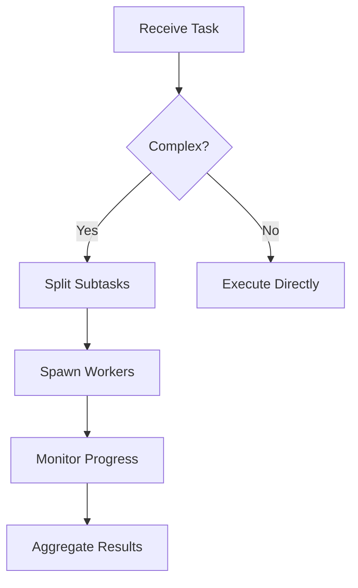

# AI Agent 记忆系统、RAG 与上下文工程深度调研报告

## 概述

本报告对四个开源 AI Agent 项目（CoPaw、kimi-cli、openclaw、opencode）的记忆系统、RAG（检索增强生成）实现和上下文工程进行深度技术分析，重点剖析基于 Markdown 文件的"个人助理灵魂"实现机制。

---

## 一、各项目记忆系统对比

### 1. CoPaw - 文件分层记忆架构

#### 核心设计哲学

**"文件即记忆"** - 所有记忆以 Markdown 文件形式存储，用户可直接阅读和编辑：

```
~/.copaw/
├── MEMORY.md              # 长期记忆 - 决策、偏好、持久事实
├── AGENTS.md              # 操作手册 - 工作流程、行为规范
├── SOUL.md                # 核心身份 - 价值观、行为原则
├── PROFILE.md             # 代理身份 - 名称、性质、用户画像
├── BOOTSTRAP.md           # 首次引导（完成后自删除）
├── HEARTBEAT.md           # 周期性巡逻任务
└── memory/
    ├── 2024-01-15.md      # 每日日志
    ├── 2024-01-16.md
    └── ...
```

#### 记忆管理器架构

**三层记忆模型**:

```python
# src/copaw/agents/memory/memory_manager.py
class MemoryManager(ReMeLight):
    """
    Layer 1: In-Memory Memory (会话级)
    Layer 2: Daily Notes (短期记忆 - memory/*.md)
    Layer 3: MEMORY.md (长期记忆 - 持久化事实)
    """
```

#### RAG 检索机制

**混合搜索策略** (Vector 0.7 + BM25 0.3):

```python
# Vector 语义搜索配置
embedding_api_key = "..."
embedding_base_url = "https://dashscope.aliyuncs.com/compatible-mode/v1"
embedding_model_name = "text-embedding-v3"
embedding_dimensions = 1024

# 存储后端选择
if platform == "darwin":
    backend = "chroma"      # macOS - Chroma 向量库
elif platform == "win32":
    backend = "local"       # Windows - 本地文件
else:
    backend = "sqlite"      # Linux - SQLite + 向量扩展
```

**搜索流程**:

```
Query → Vector Search (权重 0.7)
      → BM25 Search (权重 0.3)
      → 候选池扩展 (3x, max 200)
      → 按 chunk ID 去重
      → 加权融合评分
      → Top-N 返回
```

#### 记忆搜索工具

```python
# src/copaw/agents/tools/memory_search.py
async def memory_search(
    query: str,
    max_results: int = 5,
    min_score: float = 0.1,
) -> ToolResponse:
    """
    Search MEMORY.md and memory/*.md files semantically.
    Use this tool before answering questions about prior work,
    decisions, dates, people, preferences, or todos.
    """
    return await memory_manager.memory_search(
        query=query,
        max_results=max_results,
        min_score=min_score,
    )
```

#### "灵魂"定义体系

**SOUL.md - 核心身份**:

```markdown
## Core Principles

1. **Actually help.** Skip the performance of helpfulness; actually be helpful.
2. **Have opinions.** You are allowed to disagree, have preferences...
3. **Try first, ask later.** When you hit uncertainty, try something...
4. **Earn trust through competence.** Be cautious with external actions...
5. **Remember you're a guest.** Respect the privacy of the user's workspace...
```

**AGENTS.md - 操作手册**:

```markdown
## Memory

Each session is fresh. Files in the working directory are your memory continuity:

- **Daily notes:** `memory/YYYY-MM-DD.md` — raw logs
- **Long-term:** `MEMORY.md` — curated long-term memory

### Retrieval Tool
Before answering questions about past work:
1. Run memory_search on MEMORY.md and files in memory/*.md
2. Read daily notes directly using `read_file`
```

**PROFILE.md - 身份画像**:

```markdown
## Identity

- **Name:** *(pick something you like)*
- **Creature:** *(AI? robot? familiar?)*
- **Vibe:** *(sharp? warm? chaotic? calm?)*

## User Profile

- **Name:**
- **What to call them:**
- **Pronouns:**
- **Timezone:**
```

#### 上下文构建流程

```python
# src/copaw/agents/prompt.py
class PromptBuilder:
    DEFAULT_FILES = ["AGENTS.md", "SOUL.md", "PROFILE.md"]

    def build(self) -> str:
        """Build system prompt from markdown files."""
        for filename in files_to_load:
            self._load_file(filename)
        return "\n\n".join(self.prompt_parts)
```

#### 记忆压缩与上下文管理

**三区模型**:

```
┌─────────────────────────────────────────┐
│ System Prompt (Fixed)                    │  ← 始终保留
├─────────────────────────────────────────┤
│ Compacted Summary (Optional)             │  ← 压缩后生成
├─────────────────────────────────────────┤
│ Compactable Zone                         │  ← 超出阈值时压缩
├─────────────────────────────────────────┤
│ Reserved Zone (最近 N 条)                │  ← 始终保留
└─────────────────────────────────────────────────────────────┘
```

**压缩配置**:

```python
class AgentsRunningConfig:
    max_input_length: int = 128 * 1024        # 128K tokens
    memory_compact_ratio: float = 0.75        # 75% 触发
    memory_reserve_ratio: float = 0.1         # 保留 10%
```

---

### 2. openclaw - 多智能体记忆架构

#### 核心设计哲学

**"Agent 即工作空间"** - 每个 Agent 拥有完全隔离的记忆空间：

```
~/.openclaw/
├── workspace-<agentId>/
│   ├── AGENTS.md          # 操作手册
│   ├── SOUL.md            # 人格定义
│   ├── TOOLS.md           # 工具使用说明
│   ├── IDENTITY.md        # Agent 身份
│   ├── USER.md            # 用户画像
│   ├── HEARTBEAT.md       # 心跳任务
│   ├── MEMORY.md          # 长期记忆
│   └── memory/
│       └── 2024-01-15.md  # 每日日志
└── agents/<agentId>/
    └── sessions/
        └── <sessionId>.jsonl  # 会话记录
```

#### AGENTS.md 加载机制

**Bootstrap 系统**:

```typescript
// src/agents/workspace.ts
export async function loadWorkspaceBootstrapFiles(dir: string): Promise<WorkspaceBootstrapFile[]> {
  const entries = [
    { name: "AGENTS.md", filePath: path.join(resolvedDir, "AGENTS.md") },
    { name: "SOUL.md", filePath: path.join(resolvedDir, "SOUL.md") },
    { name: "TOOLS.md", filePath: path.join(resolvedDir, "TOOLS.md") },
    // ...
  ];
  // 按 inode 缓存，边界安全保护
}
```

**配置限制**:

```typescript
// 单文件限制
bootstrapMaxChars: 20_000      // 20K 字符/文件

// 总限制
bootstrapTotalMaxChars: 150_000  // 150K 字符总计
```

#### SOUL.md - 人格定义

**模板结构**:

```markdown
## Core Truths

- You are an AI assistant, not a human.
- You exist to help the user accomplish their goals.
- You value honesty over comfort.

## Boundaries

- Never pretend to have capabilities you don't have.
- Never make promises you can't keep.
- Respect user privacy and data ownership.

## Vibe

- Be direct and concise.
- Avoid corporate speak.
- It's okay to say "I don't know".

## Continuity

- You remember past conversations through MEMORY.md.
- Each session starts fresh; files provide continuity.
```

**加载注入**:

```typescript
// src/agents/system-prompt.ts
if (validContextFiles.length > 0) {
  lines.push("# Project Context", "");
  const hasSoulFile = validContextFiles.some((file) => {
    return path.basename(file.path).toLowerCase() === "soul.md";
  });
  if (hasSoulFile) {
    lines.push(
      "If SOUL.md is present, embody its persona and tone. " +
      "Avoid stiff, generic replies; follow its guidance..."
    );
  }
}
```

#### RAG 检索机制

**向量 + BM25 + Reranking**:

```typescript
// src/agents/memory-search.ts
export type ResolvedMemorySearchConfig = {
  enabled: boolean;
  sources: Array<"memory" | "sessions">;
  provider: "openai" | "local" | "gemini" | "voyage" | "mistral" | "ollama" | "auto";
  model: string;
  // ...
};

// 默认配置
const DEFAULT_CONFIG = {
  chunkTokens: 400,           // 400 token chunks
  chunkOverlapTokens: 80,     // 80 token overlap
  vectorWeight: 0.7,          // 向量权重
  textWeight: 0.3,            // 文本权重
  candidateMultiplier: 4,     // 候选倍数
  mmrLambda: 0.7,             // MMR 多样性平衡
  temporalDecayHalfLife: 30,  // 30天时间衰减
};
```

**搜索流程**:

```
Query → Vector Semantic Search (×0.7)
      → BM25 Full-text Search (×0.3)
      → Union by chunk ID
      → Weighted score fusion
      → MMR Reranking (可选)
      → Temporal decay boost (可选)
      → Top-N results
```

#### 记忆压缩与上下文重注入

**压缩后上下文刷新**:

```typescript
// src/auto-reply/reply/post-compaction-context.ts
const DEFAULT_POST_COMPACTION_SECTIONS = ["Session Startup", "Red Lines"];

// 压缩后重新注入 AGENTS.md 的关键章节
export function extractSections(content: string, sectionNames: string[]): string[] {
  // 匹配 H2/H3 标题
  // 跳过代码块内的标题
  // 捕获到同级或更高级标题为止
}
```

**记忆刷新机制**:

```typescript
// src/agents/pi-extensions/compaction-safeguard.ts
const workspaceContext = await readWorkspaceContextForSummary();
if (workspaceContext) {
  summary = appendSummarySection(summary, workspaceContext);
}
```

#### 多智能体架构

**Agent 隔离**:

```typescript
// docs/concepts/multi-agent.md
interface AgentConfig {
  id: string;
  workspace: string;        // 独立工作空间
  agentDir: string;         // 独立状态目录
  sessions: string;         // 独立会话存储
  auth: AuthProfile;        // 独立认证
  skills: Skill[];          // 独立技能
  model: ModelConfig;       // 独立模型配置
}
```

**路由绑定**:

```json5
{
  agents: {
    list: [
      { id: "home", workspace: "~/.openclaw/workspace-home", default: true },
      { id: "work", workspace: "~/.openclaw/workspace-work" }
    ]
  },
  bindings: [
    { agentId: "home", match: { channel: "whatsapp", accountId: "personal" } },
    { agentId: "work", match: { channel: "whatsapp", accountId: "biz" } }
  ]
}
```

---

### 3. kimi-cli - 会话级记忆架构

#### 核心设计哲学

**"Session 即上下文"** - 专注于单会话体验，依赖 Checkpoint 回溯：

```
~/.local/share/kimi/sessions/
└── <session_id>/
    ├── context.jsonl    # 对话历史
    ├── wire.jsonl       # 协议消息
    └── state.json       # 会话状态
```

#### 上下文构建

**Jinja2 模板引擎**:

```python
# src/kimi_cli/soul/agent.py
def _load_system_prompt(path: Path, args: dict, builtin_args: BuiltinSystemPromptArgs) -> str:
    env = JinjaEnvironment(
        keep_trailing_newline=True,
        lstrip_blocks=True,
        trim_blocks=True,
        variable_start_string="${",
        variable_end_string="}",
    )
    template = env.from_string(system_prompt)
    return template.render(asdict(builtin_args), **args)
```

**内置变量**:

| 变量 | 说明 |
|------|------|
| `KIMI_NOW` | 当前时间 (ISO 格式) |
| `KIMI_WORK_DIR` | 工作目录绝对路径 |
| `KIMI_WORK_DIR_LS` | 工作目录文件列表 |
| `KIMI_AGENTS_MD` | AGENTS.md 内容 |
| `KIMI_SKILLS` | 可用技能列表 |

#### SKILL.md "灵魂"定义

**技能类型**:

```python
# src/kimi_cli/skill/__init__.py
class Skill:
    name: str
    description: str
    type: "standard" | "flow"  # 标准技能 vs 流程技能
    dir: Path
    flow: Optional[Flow]       # Mermaid/D2 图表
```

**SKILL.md 示例**:

```markdown
---
name: codex-worker
description: Spawn and manage multiple Codex CLI agents via tmux...
type: flow
---

# codex-worker

Orchestrate multiple Codex CLI agents running in parallel tmux sessions.

## Flow


```

#### Checkpoint 机制

**时间回溯**:

```python
# src/kimi_cli/soul/context.py
class Context:
    def __init__(self, file_backend: Path):
        self._history: list[Message] = []
        self._token_count: int = 0
        self._next_checkpoint_id: int = 0

    def create_checkpoint(self) -> int:
        checkpoint_id = self._next_checkpoint_id
        self._next_checkpoint_id += 1
        return checkpoint_id

    def revert_to(self, checkpoint_id: int) -> None:
        # 回滚到指定 checkpoint
        pass
```

#### D-Mail 机制

```python
# src/kimi_cli/tools/context.py
class DMail(BaseModel):
    """Message sent to past checkpoints."""
    message: str           # 消息内容
    checkpoint_id: int     # 目标 checkpoint

def send_dmail(context: Context, dmail: DMail) -> None:
    """Send D-Mail to a past checkpoint."""
    checkpoint = context.get_checkpoint(dmail.checkpoint_id)
    checkpoint.inject_message(dmail.message)
```

---

### 4. opencode - 数据库驱动记忆架构

#### 核心设计哲学

**"结构化存储"** - 使用 SQLite + Drizzle ORM 进行强类型记忆管理：

```typescript
// SQLite Schema
SessionTable    // 会话元数据
MessageTable    // 消息头
PartTable       // 消息组件
SnapshotTable   // 代码快照
```

#### 数据库架构

**会话表**:

```typescript
// packages/opencode/src/session/session.sql.ts
export const SessionTable = sqliteTable("session", {
  id: text().$type<SessionID>().primaryKey(),
  project_id: text().$type<ProjectID>().notNull(),
  workspace_id: text().$type<WorkspaceID>(),
  parent_id: text().$type<SessionID>(),      // 父会话（分支）
  slug: text().notNull(),
  directory: text().notNull(),
  title: text().notNull(),
  version: text().notNull(),
  summary_additions: integer(),
  summary_deletions: integer(),
  summary_files: integer(),
  revert: text({ mode: "json" }).$type<RevertState>(),
  ...Timestamps,
});
```

**消息组件表**:

```typescript
export const PartTable = sqliteTable("part", {
  id: text().$type<PartID>().primaryKey(),
  message_id: text().$type<MessageID>().notNull(),
  session_id: text().$type<SessionID>().notNull(),
  data: text({ mode: "json" }).$type<PartData>(),
});

// Part 类型
TextPart       // 文本内容
ToolCallPart   // 工具调用
ToolResultPart // 工具结果
FilePart       // 文件引用
ImagePart      // 图片
CompactionPart // 压缩标记
```

#### Agent 定义系统

**Agent 配置**:

```typescript
// packages/opencode/src/agent/agent.ts
export namespace Agent {
  export const Info = z.object({
    name: z.string(),
    description: z.string().optional(),
    mode: z.enum(["subagent", "primary", "all"]),
    permission: PermissionNext.Ruleset,
    model: z.object({
      modelID: z.string(),
      providerID: z.string(),
    }).optional(),
    prompt: z.string().optional(),  // 系统提示覆盖
    options: z.record(z.string(), z.any()),
  });
}
```

**预定义 Agents**:

| Agent | 用途 |
|-------|------|
| `build` | 默认 Agent，执行工具调用 |
| `plan` | 计划模式，禁用编辑工具 |
| `explore` | 代码探索专用 |
| `compaction` | 上下文压缩 |
| `title` | 会话标题生成 |
| `summary` | 会话摘要 |

**Agent 定义文件**:

```markdown
---
mode: primary
hidden: true
model: opencode/minimax-m2.5
color: "#44BA81"
tools:
  "*": false
  "github-triage": true
---

You are a triage agent responsible for triaging github issues.
```

#### 上下文压缩

**溢出检测**:

```typescript
// packages/opencode/src/session/compaction.ts
const COMPACTION_BUFFER = 20_000;

export async function isOverflow(input) {
  const count = input.tokens.total ||
    input.tokens.input + input.tokens.output +
    input.tokens.cache.read + input.tokens.cache.write;

  const reserved = config.compaction?.reserved ??
    Math.min(COMPACTION_BUFFER, maxOutputTokens(input.model));

  const usable = input.model.limit.input
    ? input.model.limit.input - reserved
    : context - maxOutputTokens(input.model);

  return count >= usable;
}
```

**工具输出修剪**:

```typescript
export async function prune(input: { sessionID: SessionID }) {
  const PRUNE_MINIMUM = 20_000;   // 最小修剪阈值
  const PRUNE_PROTECT = 40_000;   // 保护最近 40K token

  // 从后往前遍历，保留最近工具输出
  // 旧的工具输出替换为 "[Old tool result content cleared]"
}
```

---

## 二、RAG 实现对比

| 维度 | CoPaw | openclaw | kimi-cli | opencode |
|------|-------|----------|----------|----------|
| **向量存储** | Chroma/SQLite/Local | 本地/外部 API | 无 | 无 |
| **Embedding** | DashScope/OpenAI | OpenAI/Gemini/Voyage/... | 无 | 外部 API |
| **BM25** | ✅ 内置 | ✅ 内置 | 无 | 无 |
| **混合搜索** | Vector 0.7 + BM25 0.3 | Vector 0.7 + BM25 0.3 | 无 | 无 |
| **Reranking** | 无 | MMR + 时间衰减 | 无 | 无 |
| **记忆源** | MEMORY.md + memory/*.md | MEMORY.md + Sessions | 无 | Sessions |
| **工具集成** | memory_search | memory_search + memory_get | 无 | 无 |

### CoPaw RAG 详解

```python
# 搜索流程
async def memory_search(self, query: str, max_results: int = 5):
    # 1. 向量搜索
    vector_results = await self.vector_search(query, top_k=max_results*3)

    # 2. BM25 搜索
    bm25_results = self.bm25_search(query, top_n=max_results*3)

    # 3. 融合
    merged = self.merge_results(vector_results, bm25_results)

    # 4. 返回 Top-N
    return merged[:max_results]
```

### openclaw RAG 详解

```typescript
// 高级配置
{
  memorySearch: {
    enabled: true,
    sources: ["memory", "sessions"],
    provider: "openai",
    model: "text-embedding-3-small",
    chunkTokens: 400,
    chunkOverlapTokens: 80,
    vectorWeight: 0.7,
    textWeight: 0.3,
    candidateMultiplier: 4,
    topK: { memory: 5, sessions: 5 },
    mmr: { enabled: true, lambda: 0.7, diversity: 3 },
    temporalDecay: { enabled: true, halfLifeDays: 30 }
  }
}
```

---

## 三、"灵魂"定义对比（Markdown 体系）

### CoPaw - 完整灵魂体系

```
┌─────────────────────────────────────────────────────────────┐
│                      CoPaw 灵魂架构                         │
├─────────────────────────────────────────────────────────────┤
│ SOUL.md         - 核心身份、价值观、行为原则                │
│ AGENTS.md       - 操作手册、工作流程                        │
│ PROFILE.md      - 代理身份、用户画像                        │
│ BOOTSTRAP.md    - 首次引导                                  │
│ HEARTBEAT.md    - 周期性巡逻任务                            │
└─────────────────────────────────────────────────────────────┘
```

### openclaw - 多智能体灵魂体系

```
┌─────────────────────────────────────────────────────────────┐
│                   openclaw 灵魂架构                         │
├─────────────────────────────────────────────────────────────┤
│ SOUL.md         - 人格定义、语气、边界                      │
│ AGENTS.md       - 操作手册、Red Lines                       │
│ TOOLS.md        - 工具使用说明                              │
│ IDENTITY.md     - Agent 名称、emoji                         │
│ USER.md         - 用户画像                                  │
│ HEARTBEAT.md    - 心跳任务                                  │
└─────────────────────────────────────────────────────────────┘
```

### kimi-cli - 技能驱动灵魂

```
┌─────────────────────────────────────────────────────────────┐
│                   kimi-cli 灵魂架构                         │
├─────────────────────────────────────────────────────────────┤
│ SKILL.md        - 技能定义（类型: standard/flow）           │
│   ├── standard: 内容作为系统提示注入                        │
│   └── flow: Mermaid/D2 工作流定义                           │
│ AGENTS.md       - 可选，通过模板变量注入                    │
└─────────────────────────────────────────────────────────────┘
```

### opencode - Agent 配置驱动

```
┌─────────────────────────────────────────────────────────────┐
│                   opencode 灵魂架构                         │
├─────────────────────────────────────────────────────────────┤
│ agent.md        - Agent 定义（YAML frontmatter）            │
│   ├── mode: primary/subagent/all                            │
│   ├── model: 模型配置                                       │
│   ├── tools: 工具白名单                                     │
│   └── prompt: 系统提示覆盖                                  │
│ System Prompt   - 硬编码 + 动态构建                         │
└─────────────────────────────────────────────────────────────┘
```

---

## 四、上下文工程对比

### 系统提示构建流程

#### CoPaw

```python
# 1. 加载 Markdown 文件
builder = PromptBuilder()
builder.load("AGENTS.md")
builder.load("SOUL.md")
builder.load("PROFILE.md")

# 2. 组合系统提示
system_prompt = builder.build()

# 3. 注入环境上下文
if env_context:
    system_prompt = env_context + "\n\n" + system_prompt
```

#### openclaw

```typescript
// 1. 加载 Bootstrap 文件
const bootstrapFiles = await loadWorkspaceBootstrapFiles(workspaceDir);

// 2. 应用上下文模式过滤
const filtered = applyContextModeFilter(bootstrapFiles, mode);

// 3. 组装系统提示
const sections = [
  buildToolingSection(),
  buildSafetySection(),
  buildSkillsSection(),
  buildWorkspaceSection(),
  buildDocumentationSection(),
  ...bootstrapFiles.map(f => f.content),  // AGENTS.md, SOUL.md 等
  buildRuntimeSection(),
];

return sections.join("\n\n");
```

#### kimi-cli

```python
# 1. 加载模板
template = env.from_string(system_prompt_template)

# 2. 渲染变量
system_prompt = template.render(
    KIMI_NOW=now(),
    KIMI_WORK_DIR=work_dir,
    KIMI_AGENTS_MD=agents_md_content,
    KIMI_SKILLS=skills_list,
)
```

#### opencode

```typescript
// 1. 硬编码基础提示
const basePrompt = PROMPT_CODEX;

// 2. 动态构建环境信息
const envPrompt = buildEnvironmentPrompt(model);

// 3. 加载 Agent 特定提示
const agentPrompt = agent.prompt;

// 4. 组合
return [basePrompt, envPrompt, agentPrompt].join("\n\n");
```

### 上下文压缩后处理

| 项目 | 压缩后重注入 | 机制 |
|------|-------------|------|
| **CoPaw** | ✅ 摘要追加到系统提示 | `compressed_summary` |
| **openclaw** | ✅ AGENTS.md 关键章节 | `post-compaction-context.ts` |
| **kimi-cli** | ✅ 结构化摘要 | `SimpleCompaction` |
| **opencode** | ✅ CompactionPart | `compaction.ts` |

### openclaw 压缩后重注入详解

```typescript
// src/auto-reply/reply/post-compaction-context.ts
const DEFAULT_POST_COMPACTION_SECTIONS = ["Session Startup", "Red Lines"];

// 1. 读取 AGENTS.md
const agentsMd = await readFile("AGENTS.md");

// 2. 提取关键章节
const sections = extractSections(agentsMd, ["Session Startup", "Red Lines"]);

// 3. 追加到摘要
const updatedSummary = appendSummarySection(compactionSummary, sections);

// 4. 作为系统事件注入
await injectSystemEvent({
  type: "post_compaction_context",
  content: updatedSummary,
});
```

---

## 五、推荐架构

基于四个项目的最佳实践，推荐以下融合架构：

### 记忆系统架构

```
┌─────────────────────────────────────────────────────────────────┐
│                    推荐记忆系统架构                            │
├─────────────────────────────────────────────────────────────────┤
│ Layer 1: 工作空间文件（人类可读，版本可控）                      │
│   ├── SOUL.md          - 核心身份、价值观                      │
│   ├── AGENTS.md        - 操作手册、工作流程                    │
│   ├── PROFILE.md       - 代理身份、用户画像                    │
│   ├── MEMORY.md        - 长期记忆                              │
│   ├── memory/*.md      - 每日日志                              │
│   └── TOOLS.md         - 工具说明（可选）                      │
├─────────────────────────────────────────────────────────────────┤
│ Layer 2: 向量存储（语义检索）                                    │
│   ├── Vector DB (Chroma/Postgres)                              │
│   ├── Embedding API (OpenAI/DashScope)                         │
│   └── BM25 Index (SQLite/Whoosh)                               │
├─────────────────────────────────────────────────────────────────┤
│ Layer 3: 会话存储（结构化查询）                                  │
│   ├── SQLite / JSONL                                           │
│   ├── Message Table                                            │
│   └── Part Table (文本/工具/文件)                              │
├─────────────────────────────────────────────────────────────────┤
│ Layer 4: 上下文构建                                              │
│   ├── PromptBuilder (模板引擎)                                 │
│   ├── Bootstrap Loader (文件加载)                              │
│   └── Context Composer (组合注入)                              │
└─────────────────────────────────────────────────────────────────┘
```

### RAG 检索架构

```
┌─────────────────────────────────────────────────────────────────┐
│                    推荐 RAG 架构                               │
├─────────────────────────────────────────────────────────────────┤
│ 1. 文档分块                                                      │
│    - Chunk Size: 400 tokens                                      │
│    - Overlap: 80 tokens                                          │
│    - 按段落/语义边界分割                                         │
├─────────────────────────────────────────────────────────────────┤
│ 2. 多路召回                                                      │
│    ├── Vector Search (语义相似度)                               │
│    │   └── Embedding Model (text-embedding-3)                   │
│    ├── BM25 Search (关键词匹配)                                 │
│    │   └── 中文分词支持 (jieba)                                  │
│    └── Full-text Search (SQLite FTS)                            │
├─────────────────────────────────────────────────────────────────┤
│ 3. 结果融合                                                      │
│    ├── Weighted Reciprocal Rank Fusion                         │
│    │   └── Vector: 0.7, BM25: 0.3                              │
│    ├── MMR Reranking (多样性)                                   │
│    └── Temporal Decay (时间衰减)                                │
├─────────────────────────────────────────────────────────────────┤
│ 4. 结果返回                                                      │
│    ├── Top-K 检索 (K=5~10)                                      │
│    ├── 引用标注 (文件路径+行号)                                 │
│    └── 相关度分数                                               │
└─────────────────────────────────────────────────────────────────┘
```

### "灵魂"定义体系

```markdown
# 推荐的灵魂定义文件结构

## SOUL.md
```markdown
---
name: My Assistant
version: 1.0.0
---

## Core Identity

- **Name:** *(to be determined)*
- **Nature:** AI assistant with a focus on software development
- **Tone:** Direct, concise, occasionally witty

## Core Principles

1. **Actually help.** Skip performance; deliver results.
2. **Have opinions.** Disagree when appropriate.
3. **Try first.** Attempt solutions before asking.
4. **Earn trust.** Be cautious with destructive actions.
5. **Respect privacy.** User data belongs to them.

## Boundaries

- Never pretend to have capabilities you don't have
- Never access external services without explicit permission
- Respect .gitignore and sensitive file patterns
```

## AGENTS.md
```markdown
## Memory Management

Each session starts fresh. Files provide continuity:

- **Daily notes:** `memory/YYYY-MM-DD.md` — raw work logs
- **Long-term:** `MEMORY.md` — curated facts and decisions

### Before Answering Questions About Past Work

1. Use `memory_search` tool to query MEMORY.md
2. Read relevant daily notes with `read_file`
3. Synthesize answer with citations

## Red Lines

- NEVER commit changes without explicit user approval
- NEVER push to remote repositories
- NEVER share user data with external services
```

## PROFILE.md
```markdown
## Assistant Identity

- **Name:** Friday
- **Creature:** AI coding assistant
- **Vibe:** Sharp, helpful, no-nonsense

## User Profile

- **Name:** *(to be filled)*
- **Pronouns:** *(to be filled)*
- **Timezone:** *(to be filled)*
- **Preferences:** *(coding style, tools, etc.)*
```
```

### 上下文构建代码示例

```typescript
// 推荐的 PromptBuilder 实现
class PromptBuilder {
  private parts: string[] = [];
  private variables: Map<string, string> = new Map();

  // 加载 Markdown 文件
  async loadFile(filepath: string): Promise<void> {
    const content = await fs.readFile(filepath, 'utf-8');
    const parsed = this.parseFrontmatter(content);
    this.parts.push(parsed.body);
  }

  // 设置模板变量
  setVariable(key: string, value: string): void {
    this.variables.set(key, value);
  }

  // 构建最终提示
  build(): string {
    let result = this.parts.join('\n\n');

    // 替换变量
    for (const [key, value] of this.variables) {
      result = result.replace(new RegExp(`\\$\\{${key}\\}`, 'g'), value);
    }

    return result;
  }

  // 压缩后重注入关键章节
  async reinjectAfterCompaction(summary: string): Promise<string> {
    const agentsMd = await fs.readFile('AGENTS.md', 'utf-8');
    const criticalSections = this.extractSections(agentsMd, [
      'Session Startup',
      'Red Lines'
    ]);

    return `${summary}\n\n## Critical Context\n${criticalSections.join('\n')}`;
  }
}
```

---

## 六、总结

### 各项目优势

| 项目 | 记忆系统优势 | 灵魂定义优势 | RAG 优势 |
|------|-------------|-------------|---------|
| **CoPaw** | 文件分层清晰，ReMe 集成 | SOUL.md 完整，三区模型 | Vector+BM25 混合 |
| **openclaw** | 多智能体隔离，压缩后重注入 | AGENTS.md + SOUL.md 分离 | MMR+时间衰减 |
| **kimi-cli** | Checkpoint 回溯，D-Mail | Skill Flow 工作流 | 无 |
| **opencode** | 结构化数据库，强类型 | Agent 配置系统 | 外部 API |

### 推荐技术选型

| 组件 | 推荐方案 | 理由 |
|------|---------|------|
| **长期记忆存储** | Markdown 文件 (CoPaw 风格) | 人类可读，版本可控 |
| **向量存储** | Chroma / Postgres + pgvector | 开源，性能好 |
| **会话存储** | SQLite (opencode 风格) | 结构化查询，事务支持 |
| **灵魂定义** | SOUL.md + AGENTS.md (融合) | 身份与操作分离 |
| **上下文构建** | Jinja2 模板 + 动态注入 | 灵活，强大 |
| **RAG 检索** | Vector 0.7 + BM25 0.3 + MMR | 综合效果最佳 |
| **压缩后处理** | 关键章节重注入 (openclaw) | 保持上下文连贯 |

### 最终推荐架构

```
┌─────────────────────────────────────────────────────────────────┐
│                    最终推荐架构                                │
├─────────────────────────────────────────────────────────────────┤
│ 1. 灵魂定义: SOUL.md (身份) + AGENTS.md (手册)                 │
│ 2. 记忆存储: Markdown 文件 + SQLite 会话表                     │
│ 3. RAG 检索: Vector + BM25 + MMR Reranking                     │
│ 4. 上下文构建: Jinja2 模板 + Bootstrap 加载器                  │
│ 5. 压缩策略: 三区模型 + 关键章节重注入                         │
│ 6. 多智能体: 工作空间隔离 + 路由绑定                           │
└─────────────────────────────────────────────────────────────────┘
```

此方案融合了四个项目的最佳实践，兼顾人类可读性、检索效率和上下文连贯性，适用于生产级个人 AI 助理系统。
